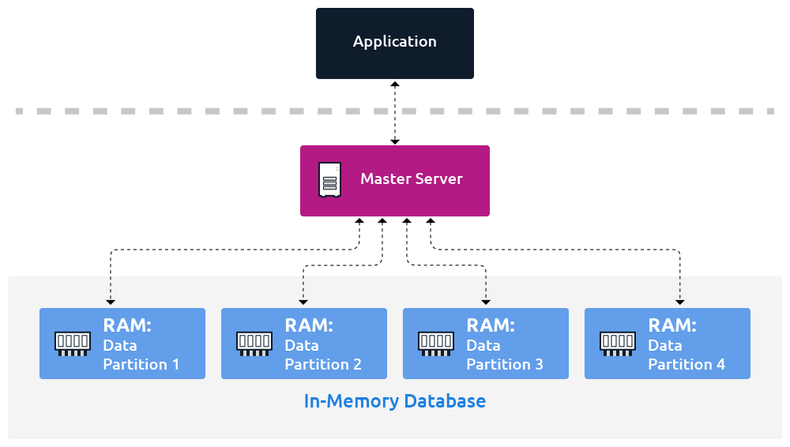

 

# IN-MEMORY DATABASE 
[**Main memory database or MMDB**](#cabecera1)

***

### What is an In-memory Databases ? 

 : They stores computer data in a computer’s main memory instead of a disk drive to produce quicker response times. On other words, they keep all its data in the random access memory (RAM) of a computer. Only the main memory is accessed when querying data. This allows for faster access of that data than a disk-based system.

 - - -

### In-memory are made for: 

 : In-memory databases are ideal for applications that require microsecond response times and can have large spikes in traffic at any time, such as game leaderboards, session stores, and real-time analytics. 

 ***

### Properties of In-memory Database Systems 

- **Atomicity** : this involves a single data transfer and avoids the optimized processing of multiple data transfers. Every transaction is "all or nothing". 
- **Consistency**: This ensures that the data exists in a consistent and valid state that complies with all defined data existence rules. 
- **Isolation**: It ensures that each transaction runs in total isolation and is completely independent of any other concurrent transactions. 
- **Durability**: It ensures the completion of a transaction once assigned, even in the event of power loss, crashes, or errors. 

 - - -
 ### How Does an In-Memory Database Work?
 
 : Data storage in an in-memory database relies on a computer’s random access memory (RAM) or main memory instead of traditional disk drives. Data is loaded into an in-memory database in a compressed and non-relational format. The data is in a directly usable format without the barrier of compression or encryption. It allows for direct navigation from index to row or column and is a read-only system.

The speed of an in-memory database is made possible by lack of translation and caching. The data is used in the same form as the application that contains it. Data access is managed by an in-memory database management system.

An in-memory database system can also act as an read-only analytic database that stores historical data on metrics for business intelligence (BI) applications. This eliminates data indexing, which can reduce IT costs. Multi-core servers, 64-bit computing and lower RAM prices have made in-memory analytics more common.

***

### Advantages of In-memory Database Systems.

1. An in-memory database system streamlines processing by eliminating multiple data transfers, reduces memory consumption by removing multiple copies of data, and simplifies processing by minimizing CPU demands. 

2. __The major advantage of systems using in-memory databases vs traditional database systems is: its performance speed.__ 

3. Source data is loaded into the system memory in a compressed and  format. Therefore, in-memory processing reduces disk seek time for accessing data and streamlining the work involved in processing queries. 

4. The internal optimization algorithms for in-memory databases are simpler and execute fewer CPU instructions, thereby facilitating faster response times than disk-optimized databases. 

5. In-memory databases allow for real-time analysis and reporting of data.

***

## IN-MEMORY DATABASES.

Comparation between 4 in-memory databases:

 |   | Redis | Kinetica | Apache Ignite | Oracle RDBMS 
-- | -- | -- | -- | -- |
**Client interface** | C, C++, Python, Lua, C# | C++, C#, Java, JavaScript, Node.js. Python, HTTP | Java, SQL, JDBC, ODBC | 
**License** |	Open Source (BSD) | Proprietary | Open Source (Apache License Version 2.0) | Proprietary
**Best Used** | Resolve very complex programming problems with simple commands executed within the data store, reducing coding effort, increasing throughput, and reducing latency. | Kinetica is an ideal solution for data discovery projects. | It was designed to store and compute on large volumes of data across a cluster of nodes.| It provides database introspection and various instruments for creating and modifying objects for the supported engines.
**Main focus** | It scales horizontally and provides ACID transactions. | An analytics platform designed to handle extremely large and complex datasets with ease. | Scaled horizontally, it distributes key-value pairs across the cluster. Data is rebalanced every time a node is added/removed from the cluster. | First database designed for enterprise grid computing. the most flexible and cost-effective way to manage information and applications
**Acronym**  | Remote Dictionary Server |   |  | Oracle Relational database management system.
**Developer** | Redis Labs | Kinetica (formerly GIS Federal) | Apache Software Foundation, GridGain Systems | Oracle Corporation
**Consistency** | It is networked, in-memory, and stores keys with optional durability. | Functions like a RDBMS (structured data) for fast analytics on datasets in the hundreds of GBs to 10's of TBs range. | Durable, strongly consistent, and highly available with powerful SQL, key-value and processing APIs. | RDBMS Oracle 12c contains an option for in-memory technology (additional licenses required).
**Platforms** | Written in ANSI C and works in most POSIX systems like Linux, *BSD, OS X. | GPU-Accelerated Database. | Apache is a platform designed to store and compute on large volumes of data across a cluster of nodes. | Make market-leading components (databases, application servers, web servers, which lets customers to implement PeopleSoft on the infrastructure.

